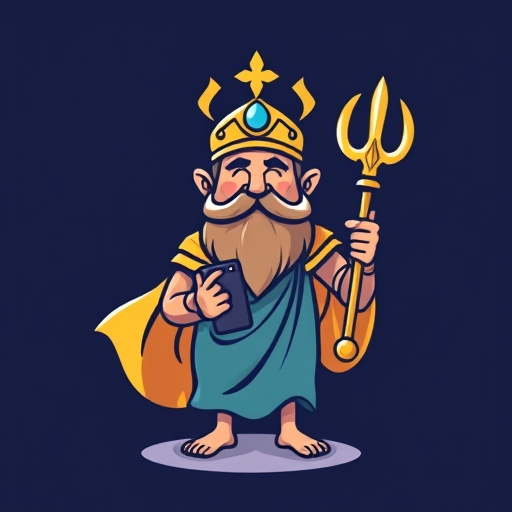

# READ ME for Hermes (Front-End) Chat App

<<<<<<< HEAD
# Summary
 - This is my front-end project for Hermes, a simple chat app.
 - I'm using React.js

# Setup

# Notes

# Libraries, Packages, etc.
- @rails/actioncable, for webSockets
- React Webhooks, for managing state
- Axios, for making HTTP requests to the backend API V1
- 

# To do:
- Test Auth with User login
- Write Unit tests
